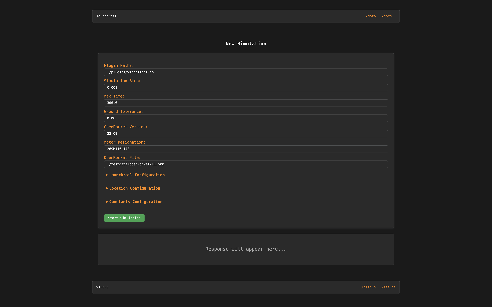
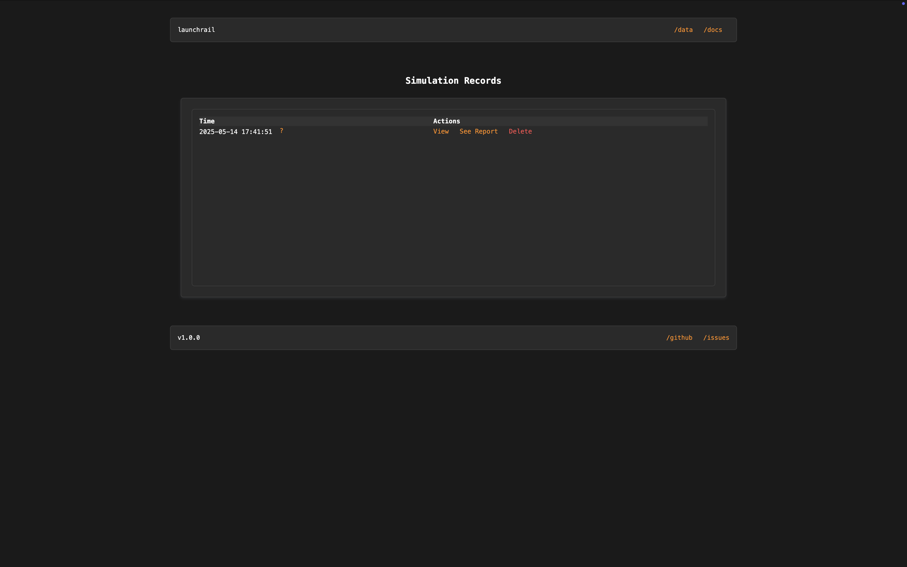
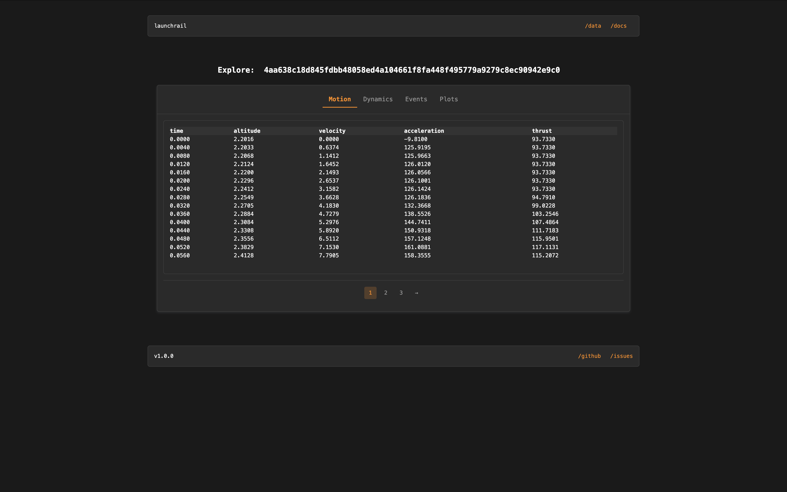
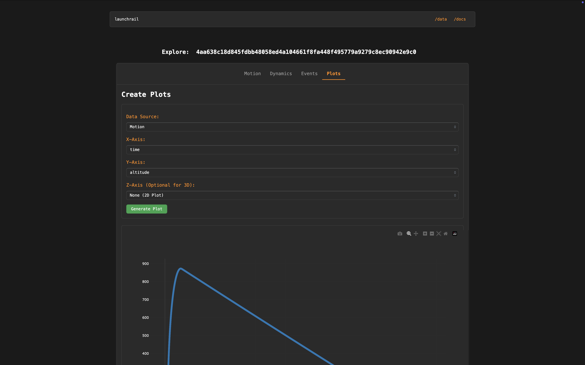

```mermaid
flowchart TD
    %% Client Layer
    subgraph "Client Layer"
        LR["launchrail CLI"]:::client
        BM["benchmark CLI"]:::client
        Browser["Browser UI"]:::client
    end
    click LR "https://github.com/bxrne/launchrail/blob/main/cmd/launchrail/main.go"
    click BM "https://github.com/bxrne/launchrail/blob/main/cmd/benchmark/main.go"

    %% Server/API Layer
    subgraph "Server/API Layer"
        API["HTTP Server"]:::server
        Handlers["REST API Handlers"]:::server
        Static["Static Assets"]:::server
        Swagger["Swagger UI"]:::server
        Templates["HTML Templates"]:::server
    end
    click API "https://github.com/bxrne/launchrail/blob/main/cmd/server/main.go"
    click Handlers "https://github.com/bxrne/launchrail/blob/main/cmd/server/handlers.go"
    click Static "https://github.com/bxrne/launchrail/tree/main/static/"
    click Swagger "https://github.com/bxrne/launchrail/tree/main/docs/swagger-ui/"
    click Templates "https://github.com/bxrne/launchrail/tree/main/templates/"

    %% Simulation Core
    subgraph "Simulation Core"
        SimMgr["Simulation Manager"]:::core
        Atmos["Atmosphere Module"]:::core
        Drag["Drag Module"]:::core
        Thrust["Thrust Curves Module"]:::core
        SimLib["Simulation Library"]:::core
        Sys["Systems Module"]:::core
        States["State Integration"]:::core
        PluginMgr["Plugin Manager"]:::core
        PluginComp["Plugin Compiler"]:::core
    end
    click SimMgr "https://github.com/bxrne/launchrail/blob/main/internal/simulation/manager.go"
    click Atmos "https://github.com/bxrne/launchrail/blob/main/pkg/atmosphere/isa.go"
    click Drag "https://github.com/bxrne/launchrail/blob/main/pkg/drag/drag.go"
    click Thrust "https://github.com/bxrne/launchrail/blob/main/pkg/thrustcurves/thrustcurves.go"
    click SimLib "https://github.com/bxrne/launchrail/blob/main/pkg/simulation/simulation.go"
    click Sys "https://github.com/bxrne/launchrail/blob/main/pkg/systems/aerodynamics.go"
    click States "https://github.com/bxrne/launchrail/blob/main/pkg/states/physics.go"
    click PluginMgr "https://github.com/bxrne/launchrail/blob/main/internal/plugin/manager.go"
    click PluginComp "https://github.com/bxrne/launchrail/blob/main/internal/plugin/compiler.go"

    %% Storage & Reporting
    subgraph "Storage & Reporting"
        Storage["Simulation Storage"]:::storage
        Records["Record Definitions"]:::storage
        Reporting["Report Generator"]:::storage
        PlotTrans["Plot Transformer"]:::storage
    end
    click Storage "https://github.com/bxrne/launchrail/blob/main/internal/storage/storage.go"
    click Records "https://github.com/bxrne/launchrail/blob/main/internal/storage/records.go"
    click Reporting "https://github.com/bxrne/launchrail/blob/main/internal/reporting/report.go"
    click PlotTrans "https://github.com/bxrne/launchrail/blob/main/internal/plot_transformer/transform.go"

    %% Config & Logging
    subgraph "Config & Logging"
        Config["Config Loader"]:::config
        Logger["Logger"]:::config
    end
    click Config "https://github.com/bxrne/launchrail/blob/main/internal/config/config.go"
    click Logger "https://github.com/bxrne/launchrail/blob/main/internal/logger/logger.go"

    %% External Services
    subgraph "External Services"
        OpenRocket["OpenRocket Reader"]:::external
        ThrustAPI["ThrustCurve API"]:::external
        Weather["Weather Service"]:::external
    end
    click OpenRocket "https://github.com/bxrne/launchrail/blob/main/pkg/openrocket/openrocket.go"
    click ThrustAPI "https://github.com/bxrne/launchrail/blob/main/internal/http_client/client.go"
    click Weather "https://github.com/bxrne/launchrail/blob/main/internal/weather/client.go"

    %% Connections
    LR --> Config
    BM --> Config
    LR --> Logger
    BM --> Logger
    LR --> SimMgr
    BM --> SimMgr

    Browser --> API
    Browser --> Static
    Browser --> Templates

    API --> Handlers
    API --> Swagger
    Handlers --> Config
    Handlers --> Logger
    Handlers --> SimMgr
    Handlers --> ThrustAPI
    Handlers --> Weather
    Handlers --> Reporting

    SimMgr --> Atmos
    SimMgr --> Drag
    SimMgr --> Thrust
    SimMgr --> SimLib
    SimMgr --> Sys
    SimMgr --> States
    SimMgr --> PluginMgr
    SimMgr --> Storage
    SimMgr --> ThrustAPI
    SimMgr --> Weather

    PluginMgr --> PluginComp
    PluginMgr --> SimMgr

    Storage --> Records
    Storage --> Reporting
    Reporting --> PlotTrans
    PlotTrans --> Browser
    PlotTrans --> LR

    %% Styles
    classDef client fill:#D0E6FF,stroke:#005F9E,color:#003366;
    classDef server fill:#DFF2D8,stroke:#3A7E28,color:#265B0E;
    classDef core fill:#FFF5CC,stroke:#BFA900,color:#8C6F00;
    classDef storage fill:#FFE5D9,stroke:#E55D3A,color:#9E2A0E;
    classDef config fill:#F0E6FF,stroke:#7D3FBF,color:#4C2571;
    classDef external fill:#E8E8E8,stroke:#8A8A8A,color:#555555;
```

# Launchrail

[](https://github.com/bxrne/launchrail/actions/workflows/lint_vet.yaml)
[](https://sonarcloud.io/summary/new_code?id=bxrne_launchrail) [](https://sonarcloud.io/summary/new_code?id=bxrne_launchrail) [](https://github.com/bxrne/launchrail/actions/workflows/benchmark.yaml) [](https://github.com/bxrne/launchrail/actions/workflows/github-code-scanning/codeql) [](https://github.com/bxrne/launchrail/actions/workflows/dependabot/dependabot-updates) [](https://github.com/bxrne/launchrail/actions/workflows/docker_publish.yaml) [](https://pkg.go.dev/github.com/bxrne/launchrail)


Launchrail is an open-source 6DOF High-Powered Rocket Simulator. It leverages [OpenRocket](http://openrocket.info/) design files for configuration and [ThrustCurve](https://www.thrustcurve.org/) API for motor curves. The project also explores using financial algorithms to model atmospheric turbulence.

<table border="0">
    <tr>
        <td></td>
        <td></td>
    </tr>
    <tr>
        <td></td>
        <td></td>
    </tr>
</table>



## 🚀 Getting Started

```sh
git clone https://github.com/bxrne/launchrail.git
cd launchrail

go run ./cmd/launchrail
# For hot reload (development)
air
```

---

## 🐳 Docker Usage

You can run Launchrail as a Docker container, either by building locally or pulling from [GHCR](https://github.com/bxrne/launchrail/pkgs/container/launchrail).

### Build and Run Locally

```sh
DOCKER_BUILDKIT=1 docker build -t launchrail:latest .
docker run --rm -it -p 8080:8080 launchrail:latest
```

### Pull and Run from GHCR

```sh
docker pull ghcr.io/bxrne/launchrail:latest
# Or pull a specific version
docker pull ghcr.io/bxrne/launchrail:<tag>
docker run --rm -it -p 8080:8080 ghcr.io/bxrne/launchrail:latest
```

---

## 🧑‍💻 Contributing & Git Workflow

We welcome contributions! See [CONTRIBUTING.md](CONTRIBUTING.md) for full guidelines.

- **Clone and branch:**
  ```sh
  git clone https://github.com/bxrne/launchrail.git
  git checkout -b my-feature-branch
  ```
- **Run tests:**
  ```sh
  go test ./... -v
  ```
- **Lint:**
  ```sh
  golangci-lint run ./...
  ```
- **Commit using Commitizen:**
  ```sh
  cz commit
  ```
  This project uses [Commitizen](https://commitizen-tools.github.io/commitizen/) and [Conventional Commits](https://www.conventionalcommits.org/en/v1.0.0/) for semantic versioning (see `.cz.toml`).
  Semantic versioning is enforced for all releases and PRs. Please use `cz commit` to ensure proper versioning and changelogs.

---

## 🧪 Testing

Run all tests:
```sh
go test ./... -v
```

---

## 🛠️ Built With

- [Go](https://golang.org/) — The Go Programming Language
- [OpenRocket](http://openrocket.info/) — Model rocket design and simulation
- [ThrustCurve](https://www.thrustcurve.org/) — Model rocket motor database

---

## 📦 License

This project is licensed under the GNU General Public License v3.0 — see the [LICENSE](LICENSE) file for details.
